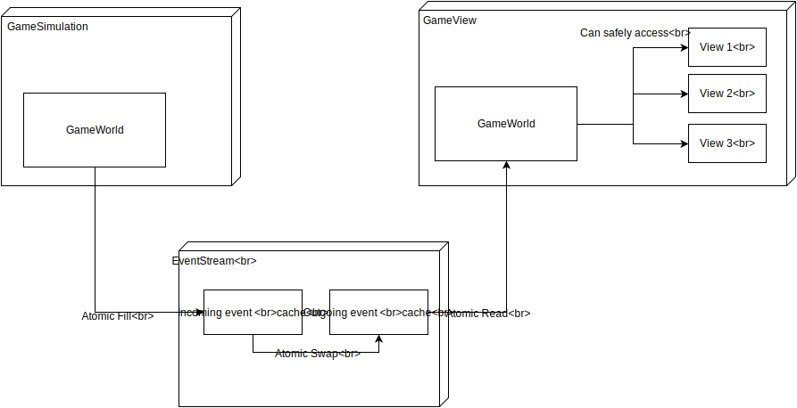

## Threading system

Stargame is distributed to several threads. The game simulation itself runs in the *Simulation-thread*, 
but gfx output etc are handled by the *view-thread*.
This page describes how these threads interact with one another.

Both threads contain a copy of the game world. The simulation thread owns the master copy, in which the actual 
game is run. Each game step thus generates "update events", which are update of position, velocity etc. for each object,
as well as updates for each property that has changed.

These generates update events are then written into a helper class `EventStream`, into the container *I*. This still happens from within the 
simulation thread and is protected by mutex *A*. 
The EventStream class contains a second copy *O* of the event container. This one is used to update the view thread world
from within the view thread. After updating has finished, mutex *A* is locked (which means we have written a consistend step into 
the *I* container) and we swap containers *I* and *O*. 

This architecture guarantees:
* the simulation world is only accessed from within the simulation thread.
* the view world is only accessed from within the view thread.
* we always send complete steps from simulation to view.

TODO:
* in terms of efficientcy, there is still room for improvement: if we do two simulation steps for one
  view step, we are sending the game object updates twice.

